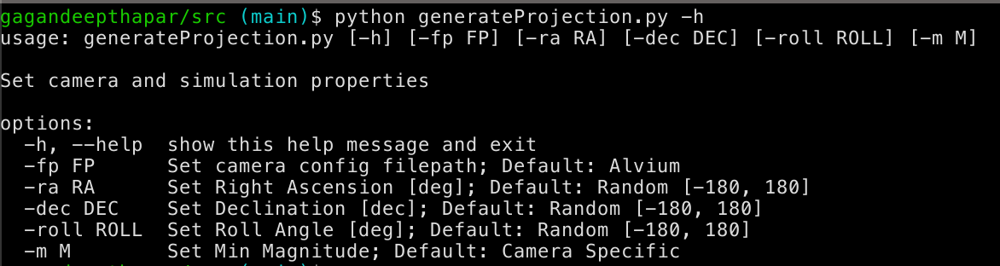
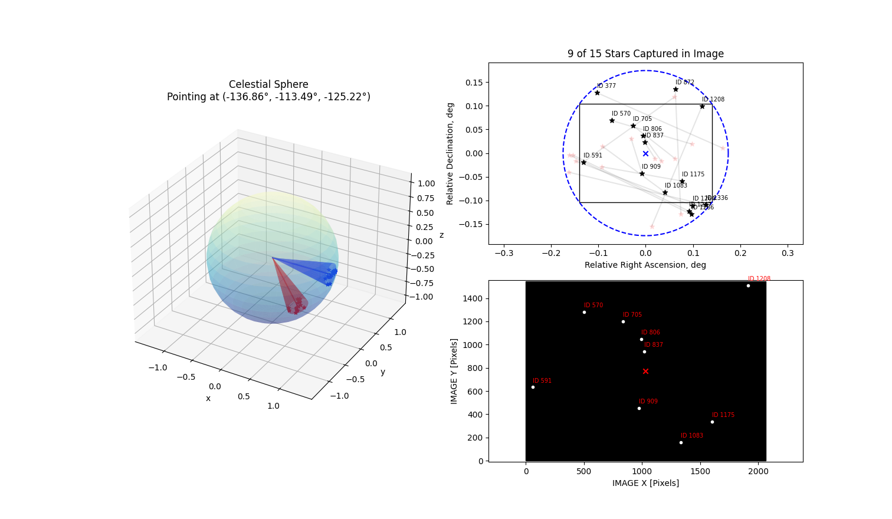
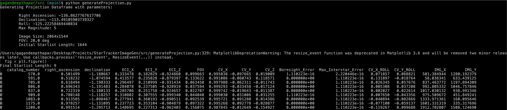
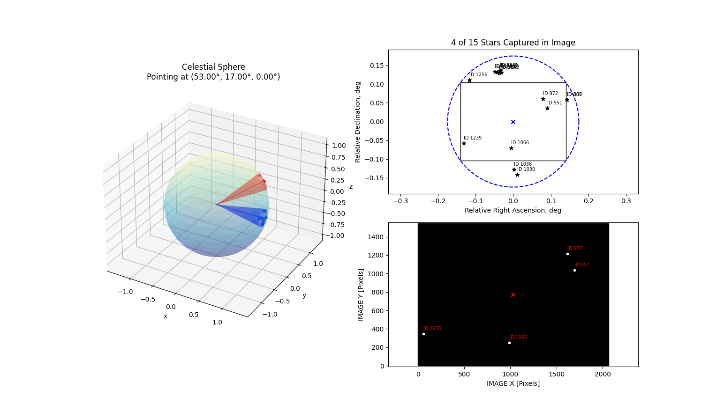
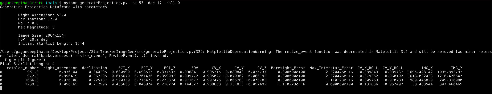

# Star Tracker Simulated Image Generator
## Tool to generate simulated images for star tracker centroid testing

### Background
A star tracker is a type of attitude determination sensor flown on spacecraft. It operates under the principle of capturing an image of the "sky" (AKA the celestial sphere), identifying stars in the image, relating the pointing direction in an absolute reference frame, and returning a quaternion representing the attitude. One of the processes is called the **centroiding** process which determines the center of all stars in a given image.

### Motivation
In order to properly test the centroiding phase, images need to be generated and passed through. These images can be created by taking real images of the night sky (which is susceptible to environmental/sky conditions and a function of the camera) or creating realistic images. This generator create images based on a given (or random) pointing direction and camera properties (e.g., FOV, sensor quality, etc.) with an associated CSV containing true centroid information. This can be used to test the centroiding step and measure accuracy and precision.

### Generator in Action
The generator makes use of the *argparse* library to ingest user data (or use default values) to create images

The tool can be run without any arguments (e.g., as seen below when where we can find the Big Dipper)

The tool also prints out the relevant information of stars in the image e.g., their camera and ECI vectors

The tool can also ingest specific data in case specific pointing directions want to be viewed

It should be noted that these analysis plots do not contain the actual image the star tracker would see, but a representation of where the stars should be located. The actual images are generated by calling a different script (WIP).

The generateProjections tool creates a CSV containing image information that can be used as the ground truth data against the results of the centroiding algorithm